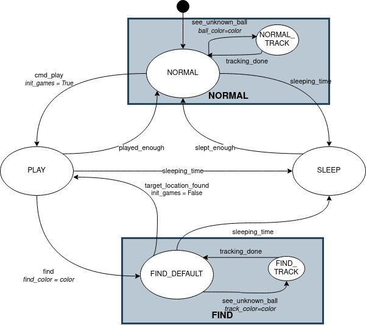
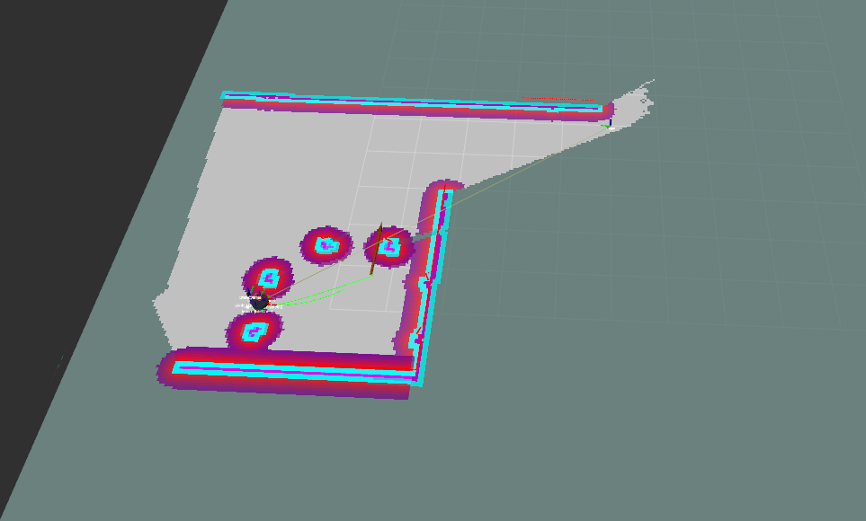
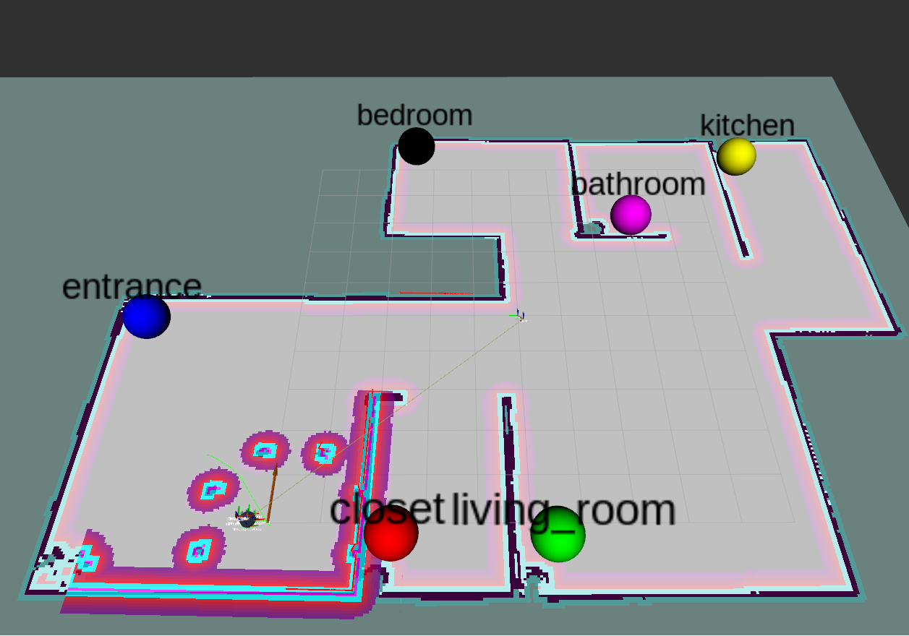

# exp_assignment3
<!-- PROJECT SHIELDS -->
<!--
*** I'm using markdown "reference style" links for readability.
*** Reference links are enclosed in brackets [ ] instead of parentheses ( ).
*** See the bottom of this document for the declaration of the reference variables
*** for contributors-url, forks-url, etc. This is an optional, concise syntax you may use.
*** https://www.markdownguide.org/basic-syntax/#reference-style-links
-->
[![Contributors][contributors-shield]][contributors-url]
[![Forks][forks-shield]][forks-url]
[![Stargazers][stars-shield]][stars-url]
[![Issues][issues-shield]][issues-url]
[![MIT License][license-shield]][license-url]
[![LinkedIn][linkedin-shield]][linkedin-url]


<!-- PROJECT LOGO -->
<br />
<p align="center">
  <h3 align="center">EXPERIMENTAL ROBOTICS - FINAL ASSIGNMENT</h3>

  <p align="center">
    This repository contains the third and final assignment of the experimental robotics laboratory course 2020 at the University of Genoa.
    It can be used to play around with ros. It contains only simulations, so no special hardware is needed.
    The doxygen-documantation of the code can be found here:
    <br />
    <a href="https://filiphesse.github.io/exp_assignment3/"><strong> « « API » » </strong></a>
    <br />
    <br />
    <a href="https://github.com/FilipHesse/exp_assignment3/issues">Report Bug</a>
    ·
    <a href="https://github.com/FilipHesse/exp_assignment3/issues">Request Feature</a>
  </p>
</p>


<!-- TABLE OF CONTENTS -->
## Table of Contents

- [exp_assignment3](#exp_assignment3)
  - [Table of Contents](#table-of-contents)
  - [About The Project](#about-the-project)
    - [Built With](#built-with)
  - [The Robot](#the-robot)
  - [Software architecture](#software-architecture)
    - [Component Diagram](#component-diagram)
    - [Launchfiles](#launchfiles)
    - [Ros parameters](#ros-parameters)
    - [Messages, services and actions](#messages-services-and-actions)
    - [State Machine](#state-machine)
  - [Packages and file list](#packages-and-file-list)
  - [Getting Started](#getting-started)
    - [Prerequisites](#prerequisites)
    - [Installation](#installation)
  - [Usage](#usage)
  - [Working hypothesis and environment](#working-hypothesis-and-environment)
  - [Systems features](#systems-features)
  - [Systems limitations](#systems-limitations)
  - [Possible technical improvements](#possible-technical-improvements)
  - [License](#license)
  - [Contact](#contact)


<!-- ABOUT THE PROJECT -->
## About The Project

The aim of this assignemt is to get acquainted with autonomous navigation in ROS and simlutaneous localization and mapping (SLAM). Furthermore, it is based on the other two assignments, that were focused on building ROS software architecures and finite state machines using smach as well as creating robot models with URDF and perform Simulations in Gazebo.
We have the following scenario: A robot is navigating autonomously in the following world:


The world is composed of 6 rooms, that have a colored ball inside of them. Each ball has a different color. Each color is mapped to a specific room name (e.g. blue ball: kitchen). The world is completely unknown to the robot at the beginning of program execution.

The robot will behave differently depending of its current state. It can be in four different states (some of them have substates): 
* NORMAL: 
  * NORMAL_DEFAULT: The robot moves around randomly within the known map
  * NORMAL_TRACK: The robot sees a new ball, that it has not seen before. It approaches that ball and saves its position.
* PLAY: 
  * The robot approaches the person and waits for a "go to" command (e.g go_to kitchen). If the given room is known, the robot goes to that position and comes back to the user. If it is unknown, it switches to the state FIND to find that room.
* SLEEP: 
  * The robot returns to the position of a house and sleeps for some time, then it wakes up and returns to normal
* FIND:
  * FIND_DEFAULT: The robot explores the area with a frontier based approach
  * FIND TRACK: The robot sees a new ball, that it has not seen before. It approaches that ball and saves its position.

### Built With

* [ROS noetic](http://wiki.ros.org/noetic/Installation)
* [Python3](https://www.python.org/downloads/)
* [Smach](http://wiki.ros.org/smach)
* [Gazebo](http://gazebosim.org/)
* [Gmapping](http://wiki.ros.org/gmapping)
* [DWA local planner](http://wiki.ros.org/dwa_local_planner)

## The Robot
The used robot is depicted below:


The positive driving direction of the robot on the image would be to the right.
It is a differential drive robot with two idle castor wheels to ensure stability. A diagonal pole is mounted on top of the platform, that holds two sensors: A camera and a hokuyo laser scanner. The reason, why the pole is diagonal is the following: For visual servoing, it is not beneficial, if the camera is located at the front of the robot. Because in this case, when the robot is approaching a corner in the world, the camera (being the frontmost part) might capture something that just appeared behind a corner. If the robot then tries to approach that captured object and rotates towards it, the camera will loose the object again, because the robot chassis is still located in front the corner.
Mounting the camera in the present way (BEHIND the chassis) will ensure, that the robot has passed a corner before the object of interest will be seen by the camera. Rotating towards the object will never result in loosing the object again.

## Software architecture

### Component Diagram


The ros package exp_assignment3_pkg contains 4 self written nodes, which are: 
* <strong>ui</strong> : 
  * This node is the simulated user interface. It is a service client, that creates commands to simulate the users behavior. The programmer has chosen a service over a publisher, because we want to
  make sure no message gets lost.
  It creates and sends two types of commands:
    1) command="play" room="" to notify the robot to go to playing mode
    2) command="go_to" room="room" (e.g. kitchen) to give the robot a target room
  * Each n-th command is a play command, the other commands are go_to commands. The n must be set using the ROS parameter server, parameter "/n_commands_till_play_command".
  Between two commands, there is always a rondom time passing between "/time_between_commands_min" and "/time_between_commands_max" seconds (ros parameters).
  * Requires ROS parameters: 
    * /n_commands_till_play_command
    * /time_between_commands_min
    * /time_between_commands_max
* <strong>behavior_state_machine</strong> :
  * This is the heart of the exp_assignment_pkg package, which defines the robots behavior
  * Contains a finite state machine implemented in smach. The 4 main states of the
  robot pet are NORMAL, PLAY, SLEEP and FIND. The state diagram can be found below
  * Each interface with the ROS infrastructure, such as service clients,
  servers, action clients and publishers are implemented within separate
  classes. All these interfaces are then passed to the smach-states while they
  are constructed, in order to make the interfaces accessible for the states.
  * This node can trigger three ways of making the robot move. Each of those ways will only be triggered uniquely depending on the current state, so there will be no conflicts like multiple nodes attempt to control the robots motion simultaneously:
    * 1.) Send a goal to the move_base action server, cancel goal when changing the state
    * 2.) Call the service explore/start to start exploration of the area with explore_lite, call the service explore/stop when leaving the state
    * 3.) Call the action server follow_ball/goal to track a ball, cancel the goal when leaving the state before tracking is done
  * Additionally, this node publishes the very useful topic `/what_is_going_on`. The user can echo this topic in the terminal (`rostopic echo /what_is_going_on`) to get insights about she current states, incoming messages, state of the sleeping timer etc. (more on that in the section "Usage") 
  * It also publishes markers for RVIZ under the topic `/room_info`. Specifically, all known room positions are periodically published as sphere-shaped markers with a text on top. These markers can be displayed in RVIZ to visualize where the balls are located including their color and the according room name, see the image below.
  * 
  * Requires ROS parameters:
    * /house_x
    * /house_y
    * /user_x
    * /user_y
    * /run_sleeping_timer
    * /sleeping_time_min
    * /sleeping_time_max
    * /awake_time_min
    * /awake_time_max
* <strong>image_processor</strong> :
  * This node subscribes to the image topic of the camera on top of the robot and processes the image in the following way: It detects tries to find all colored balls in the image by performing color based image segmentation. If multiple balls are detected, the ball that is closer to the center of the image (horizontally) is chosen. The contour and the centroid are then computed. It publishes 3 topics:
    * Publishes, if the ball is visible and its color (camera1/ball_visible)
    * Publishes the processed camera image with the marked contour and centroid of the ball
    * Publishes the detected balls center and radius (camera1/ball_center_radius) 
* <strong>ball_follower</strong> :
  * This node makes the robot approach the ball, that is detected by the image_processor by publishing appropriate velocity commands. Image based visual servoing is implemented: the node knows from a subscribed topic (camera1/ball_center_radius) the position and the size of the ball in the image frame. From this information the node computes an angular and linear velocity such that the ball will be located in the image center with a specified size (-> distance).

Additionally, there are four nodes, that are used, but mostly not self written (maybe slightly modified):
* <strong>slam_gmapping</strong> :
  * This node performs SLAM, so it localizes the robot inside the map, that it created itself based on sensor readings and ometry. The node was just parametrized according to the documentation (see [gmapping](http://wiki.ros.org/gmapping))
* <strong>explore_lite</strong> :
  * Explore lite is a node, that performs frontier based exploration of the world. It was forked from the original [repository](https://github.com/hrnr/m-explore) and modified in a way, that it supports activating and deactivating in runtime (see [fork](https://github.com/FilipHesse/m-explore))
* <strong>move_base</strong> :
  * Move_base is the core node of the ROS navigation stack. It allows the user to publish goal poses in the map and this node will create a global and a local path, which is then immedialty followed (by publishing to the `/cmd_vel` topic). We chose the [DWA local planner](http://wiki.ros.org/dwa_local_planner) and the [NavfnROS global](http://wiki.ros.org/navfn) planner. These are configured in the `launch/move_base.launch` of the exp_assignment3_pkg package. More on move_base [here](http://wiki.ros.org/move_base)
* <strong>gazebo</strong> :
  * Ganzebo is a widely-used simulation tool to simulate robots and their environment including physics. More on Gazebo [here](http://wiki.ros.org/gazebo_ros_pkgs)


### Launchfiles

The only relevant launchfiles for the end user are `exp_assignment3_pkg/launch/simulation.launch` and `exp_assignment3_pkg/launch/simulation_manual_ui.launch`. All the other launchfiles will just launch fractions of the system, which is only useful for debugging. The first one will start the simulation including the simulated user interface, that constantly gives random commands to the state machine. The second one will launch the simulation without the simulated user interface. The robot will be in the NORMAL state until it receives a command via `rosservice call`. Two examples of usage are:
```sh
rosservice call /pet_command "header:
  seq: 0
  stamp:
    secs: 0
    nsecs: 0
  frame_id: ''
command: 'play'
room: ''" 
```

```sh
rosservice call /pet_command "header:
  seq: 0
  stamp:
    secs: 0
    nsecs: 0
  frame_id: ''
command: 'go_to'
room: 'closet'" 
```
  
### Ros parameters

Several ROS parameters can be set to modify this software: 
* /house_x (float): x position, that the robot considers as the house to go to sleep
* /house_y (float): y position, that the robot considers as the house to go to sleep
* /user_x (float): x position of the user, where the robot goes in playmode to receive commands
* /user_y (float): y position of the user, where the robot goes in playmode to receive commands
* /run_sleeping_timer (bool): Should the sleeping timer run? If False, then time to sleep will be triggered in 31,7 years.
* /sleeping_time_min (float): How many seconds should the robot sleep at least
* /sleeping_time_max (float): How many seconds should the robot sleep at most
* /awake_time_min (float): How many seconds should the robot be awake at least
* /awake_time_max (float): How many seconds should the robot be awake at most
* /n_commands_till_play_command: Configuration of the simulated ui: How many go_to commands should be sent until a play command is triggered
* /time_between_commands_min: How much time passes between two commands at least
* /time_between_commands_max: How much time passes between two commands at most
  
### Messages, services and actions

The following <strong>ROS-messages</strong> have been defined:
* `BallCenterRadius.msg`: Contains the center and the radius of a ball in the image plane. The values are integer pixel coordinates. It also contains a boolean flag, which is True, if a ball is visible at all.
```sh
std_msgs/Bool visible
std_msgs/Int64 center_x
std_msgs/Int64 center_y
std_msgs/Int64 radius
```
* `BallVisible.msg`: Is a ball visible? If yes: which color does it have?
```sh
std_msgs/Bool visible
std_msgs/String color
```

* `WhatIsGoingOn.msg`: Contains a lot of statusinformation of the state machine node. The underscores in the names make the message more readable when it is inspected via `rostopic echo /what_is_going_on` 
```sh
string state___________________
string substate_normal_________
string substate_find___________
string sleep_timer_info________
string last_command____________
string command_processing______
string PLAY_game_info__________
bool PLAY_waiting_for_command

string room_info_0
string room_info_1
string room_info_2
string room_info_3
string room_info_4
string room_info_5
```
Most of the content shold be self-explanatory. here is a sample output when using `rostopic echo /what_is_going_on`:
```sh
---
state___________________: "FIND"
substate_normal_________: "None"
substate_find___________: "FIND_DEFAULT"
sleep_timer_info________: "Now its time to be awake. Sleeping time in 34 s"
last_command____________: "Command: go_to, room: living_room"
command_processing______: "Command: go_to, room: kitchen"
PLAY_game_info__________: "Played 0 out of 3 games"
PLAY_waiting_for_command: False
room_info_0: "Color: blue, name: entrance, x: -0.35569458605330273, y: 8.1596427593041"
room_info_1: "Color: red, name: closet, x: None, y: None"
room_info_2: "Color: green, name: living_room, x: -5.540466501108668, y: -0.3348494744114211"
room_info_3: "Color: yellow, name: kitchen, x: None, y: None"
room_info_4: "Color: pink, name: bathroom, x: 3.097671863011574, y: -2.7194393734109985"
room_info_5: "Color: black, name: bedroom, x: None, y: None"
---
```
One note about the entrys last_command and command_processing: The ui sends a lot of random commands disregarding any state of the robot. So many commands will be send, which are completely invalid for that specific situation. So last_command will display all incoming messages, even those that can not be applied. Command processing displays a command, that came in a valid moment, so it is processed by the state machine.


The following <strong>ROS-service</strong> has been defined:

* PetCommand.srv: A string command ("play", "go_to") can be sent. If the command is "go_to", then a string for the target room should be specified. Possible rooms are entrance, closet, living_room, kitchen, bathroom, bedroom.
```sh
Header header
string command 
string room
---
```
The following <strong>ROS-action</strong> has been defined:

* EmptyAction: This action is used to tell the ball follower to follow (track) a ball. The goal, result and feedback part are completely empty. We just need the basic functions of an action server (e.g. the possibility to cancel) without passing information between the nodes.


### State Machine


The above state diagram shows clearly the four main states of the system:
* NORMAL: 
  * NORMAL_DEFAULT: 
    * The robot moves around randomly within the known map. 
    * The target points for the move_base node are random points within the map dimensions. This node checks, if the goal point has a cost of 0 in the global cost map (free, explored space). If that is not the case, another random goal is created, until it lands is the free space of the costmap.
    * Once a goal has been reached by move base (action terminated successfully), a new goal is sent
  * NORMAL_TRACK: 
    * The robot sees a new ball, that it has not seen before. It approaches that ball and saves its position. 
    * This substate simply sets an empty goal the action /follow_ball/goal and waits until the action is finshed successfully. In this substate, the robot does not listen for commands like play, but it finshes tracking first. This makes sense, because while tracking a ball, the area will be mapped with the laser scanner. Consequently the area will not be unknown anymore, so in the FIND-state the robot will not navigate into this area anymore. This is why we have to finish tracking once we have started it.
* PLAY: 
  * The robot approaches the person and waits for a "go to" command (e.g go_to kitchen). If the given room is known, the robot goes to that position and comes back to the user. If it is unknown, it switches to the state FIND to find that room.
  * The information, if a room is known or unknown (including its position and ball color) is stored in a global variable: `room_info.info` (it can be found in the file exp_assignment3_pkg/scripts/room_info.py) 
  * If the input key `init_games` was set to True, a random number of games between 2 and 4 is chosen. When these games were played, the robot goes back to NORMAL state.
* SLEEP: 
  * The robot returns to the position of a house and sleeps for some time, then it wakes up and returns to normal
* FIND:
  * FIND_DEFAULT: 
    * The robot explores the area with a frontier based approach. 
    * The explore_lite package is used for exploring the environment, although we are not using the original package, but the author created a fork of the original one and added some functionality to the source code: The node can be started and stopped by calling the two services: /explore/start, /explore/stop 
  * FIND_TRACK: The robot sees a new ball, that it has not seen before. It approaches that ball and saves its position. This state is leterally the same state as the NORMAL_TRACK state. It will just switch back to TRACK_DEFAULT instead of NORMAL_DEFAULT

Here two screenshots of RVIZ at the beginning of the simulation and at the end:




## Packages and file list
 The main package of this project is exp_assignment3_pkg. However, the modified explore_lite was used, so the source code of this package is also contained in this project. Note, that both packages were included as submodules, so pay attention to include the `--recurse-submodules` flag when cloning this repository.

 The following file tree shows the contents of the catkin_ws/src directory:

```sh
.
├── CMakeLists.txt -> /opt/ros/noetic/share/catkin/cmake/toplevel.cmake
├── exp_assignment3_pkg
│   ├── action
│   │   └── Empty.action
│   ├── CMakeLists.txt
│   ├── config
│   │   ├── base_planner_params.yaml
│   │   ├── costmap_common_params.yaml
│   │   ├── global_costmap_params.yaml
│   │   ├── gmapping_params.yaml
│   │   ├── local_costmap_params.yaml
│   │   ├── motors_config.yaml
│   │   └── rviz_config.rviz
│   ├── launch
│   │   ├── gmapping.launch
│   │   ├── launch_world.launch
│   │   ├── move_base.launch
│   │   ├── simulation.launch
│   │   ├── simulation_manual_ui.launch
│   │   └── spawn_robot.launch
│   ├── msg
│   │   ├── BallCenterRadius.msg
│   │   ├── BallVisible.msg
│   │   └── WhatIsGoingOn.msg
│   ├── package.xml
│   ├── scripts
│   │   ├── ball_follower.py
│   │   ├── behavior_state_machine.py
│   │   ├── image_processor.py
│   │   ├── room_info.py
│   │   ├── states.py
│   │   └── ui.py
│   ├── srv
│   │   └── PetCommand.srv
│   ├── urdf
│   │   ├── human.urdf
│   │   ├── robot.gazebo
│   │   └── robot.xacro
│   └── worlds
│       ├── gazebo
│       │   ├── model.config
│       │   └── model.sdf
│       ├── house2_with_gazebo.world
│       └── house2.world
└── explore_lite
    ├── CHANGELOG.rst
    ├── CMakeLists.txt
    ├── doc
    │   ├── architecture.dia
    │   ├── screenshot.png
    │   └── wiki_doc.txt
    ├── include
    │   └── explore
    │       ├── costmap_client.h
    │       ├── costmap_tools.h
    │       ├── explore.h
    │       └── frontier_search.h
    ├── launch
    │   ├── explore_costmap.launch
    │   └── explore.launch
    ├── LICENSE
    ├── package.xml
    ├── README.md
    └── src
        ├── costmap_client.cpp
        ├── explore.cpp
        └── frontier_search.cpp
```
<!-- GETTING STARTED -->
## Getting Started

To get a local copy up and running follow these simple steps.

### Prerequisites

This package was developed on Ubuntu 20.04, using [ROS noetic](http://wiki.ros.org/noetic/Installation) and [Python3](https://www.python.org/downloads/) (Click on ROS or python for installation instructions)

Further required packages are opencv, gmapping and the DWAlocal planner. You can install them using these three commands:
```sh
sudo apt install python3-opencv
sudo apt-get install ros-noetic-gmapping
sudo apt-get install ros-noetic-dwa-local-planner
```
### Installation

1. Clone the repo with the __--recurse-submodules Flag__
```sh
git clone --recurse-submodules https://github.com/FilipHesse/exp_assignment3
```

<!-- USAGE EXAMPLES -->
## Usage

To run the project, perform the following steps (from catkin_ws):
1) Source the ros distribution
```sh
source /opt/ros/noetic/setup.bash
```
2) Navigate to catkin_ws
```sh
cd exp_assignment3/catkin_ws
```
3) catkin_make the project, so all message files will be created
```sh
catkin_make
```
4) Type
```sh
source devel/setup.bash
```
5) Run the launchfile:
```
roslaunch exp_assignment3_pkg simulation.launch 
``` 
  or if you want to type commands manually (to have more control):
```
roslaunch exp_assignment3_pkg simulation_manual_ui.launch 
``` 
6) To understand, what the state machine is doing, you should echo the ROS topic /what_is_going_on:
```
rostopic echo /what_is_going_on
``` 
7) Sit back and enjoy the show!

You will be able to observe the robot moving end exploring in RVIZ. While watching RVIZ always keep an eye on the /what_is_going_on topic to see incoming commands, the commands, that are processed, the states of the state machine, the countdown to go to sleep/ wake up etc.


## Working hypothesis and environment
The environment is defined by the gazebo world `house2_with_gazebo.world`:


The world is composed of 6 rooms, that have a colored ball inside of them. Each ball has a different color. Each color is mapped to a specific room name (e.g. blue ball: kitchen). The world is completely unknown to the robot at the beginning of program execution.

The world is completely static, so there are no moving or variable obstacles. The balls have a uniform color, which can not be found anywhere else in the entire environment. This ensures the correct ball detection.

## Systems features
* autonomous navigation of a robot in an ideal indoor environment
* building a map autonomously with frontier bases exploration and SLAM 
* Reliable detection of colored balls in a controlled environment
* Perform visual servoing to approach a target detected by the camera
* Visualization of the map, and costmap in RVIZ including the colored balls, that have been found, as colored markers
* Comprehensive debugging tools like the /what_is_going_on topic
* A test of 4 hours was performed without any deadlock or major problems => the system is quite stable

## Systems limitations

Very rarely the robot gets stuck in a corner or very close to the wall. This happens, if for some reason the local planner aproached the wall too much and navigated into a corner. Then, no local path can be found to get out of that situation, sometimes even the recovery mechanisms fail. As a workaround, the user can grad the robot in gazebo and move it a bit away from the wall.

When the robot is in the TRACK state, pure visual servoing is performed. It is naively assumed, that there is no obstacle in the way if we can see the target. Due to the fact, that the robot has a certain width, it can happen, that the robot crashes into an obstacle while approaching a colored ball. A crash while tracking might lead to following problems: The target might get lost from the camera view and the state machine switches back to its previous state (NORMAL or FIND). The problem is, that the laser scanner probably mapped the area without the ball being reached and saved. Thus, in the find mode, the robot will not search for that ball in this area anymore, as it is assumed to be explored. The robot might end up not moving at all, if the entire area is explored but one ball is still not found. Nevertheless, the programm will not be in a complete deadlock. When its time to sleep, the robot will continue moving and afterwards the NORMAL/PLAY behaviors will continue to work. By chance the robot could still find the lost ball in NORMAL mode.
## Possible technical improvements
The local planner could probably be improved. Either, a completely different local planner chould be chosen or some parameters of the present local planner could be changed. The DWA local planner definitely has one major drawback: It will not simply rotate inplace to change its heading and then continue its path. It always tries to find a trajectory composed of a linear and angular velocity. This occasionally leads to circular trajectories, so that the robot moves in circles multiple times.

The ball follower could be improved to not simply publish cmd_vel messages, but goals to move_base when trying to approach a ball. The goals could be located just at some distance right in front of the robot. This way, the local planner would try to avoid obstacles.

Furthermore, the FIND state could be extended toperform random movements, if the entire map is explored but not all balls were found. However this is just necessary in case of previous bugs. The laser scanner has the same field of view as the camera, so anything that the laser scanner maps should also be seen by the camera.

<!-- LICENSE -->
## License

Distributed under the MIT License. See `LICENSE` for more information.


Project Link: [https://github.com/FilipHesse/exp_assignment3](https://github.com/FilipHesse/exp_assignment3)


## Contact

Filip Hesse - S4889393(at)studenti.unige.it


<!-- MARKDOWN LINKS & IMAGES -->
<!-- https://www.markdownguide.org/basic-syntax/#reference-style-links -->
[contributors-shield]: https://img.shields.io/github/contributors/FilipHesse/experimental_robotics_lab1.svg?style=flat-square
[contributors-url]: https://github.com/FilipHesse/experimental_robotics_lab1/graphs/contributors
[forks-shield]: https://img.shields.io/github/forks/FilipHesse/experimental_robotics_lab1.svg?style=flat-square
[forks-url]: https://github.com/FilipHesse/experimental_robotics_lab1/network/members
[stars-shield]: https://img.shields.io/github/stars/FilipHesse/experimental_robotics_lab1.svg?style=flat-square
[stars-url]: https://github.com/FilipHesse/experimental_robotics_lab1/stargazers
[issues-shield]: https://img.shields.io/github/issues/FilipHesse/experimental_robotics_lab1.svg?style=flat-square
[issues-url]: https://github.com/FilipHesse/experimental_robotics_lab1/issues
[license-shield]: https://img.shields.io/github/license/FilipHesse/experimental_robotics_lab1.svg?style=flat-square
[license-url]: https://github.com/FilipHesse/experimental_robotics_lab1/blob/master/LICENSE.txt
[linkedin-shield]: https://img.shields.io/badge/-LinkedIn-black.svg?style=flat-square&logo=linkedin&colorB=555
[linkedin-url]: https://linkedin.com/in/FilipHesse
[product-screenshot]: images/screenshot.png