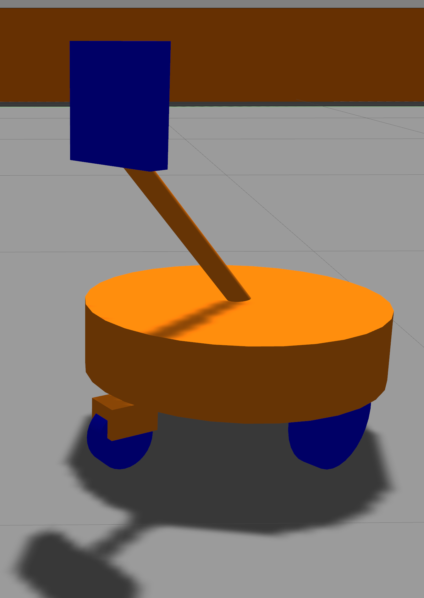

# exp_assignment3
<!-- PROJECT SHIELDS -->
<!--
*** I'm using markdown "reference style" links for readability.
*** Reference links are enclosed in brackets [ ] instead of parentheses ( ).
*** See the bottom of this document for the declaration of the reference variables
*** for contributors-url, forks-url, etc. This is an optional, concise syntax you may use.
*** https://www.markdownguide.org/basic-syntax/#reference-style-links
-->
[![Contributors][contributors-shield]][contributors-url]
[![Forks][forks-shield]][forks-url]
[![Stargazers][stars-shield]][stars-url]
[![Issues][issues-shield]][issues-url]
[![MIT License][license-shield]][license-url]
[![LinkedIn][linkedin-shield]][linkedin-url]


<!-- PROJECT LOGO -->
<br />
<p align="center">
  <h3 align="center">EXPERIMENTAL ROBOTICS - FINAL ASSIGNMENT</h3>

  <p align="center">
    This repository contains the third and final assignment of the experimental robotics laboratory course 2020 at the University of Genoa.
    It can be used to play around with ros. It contains only simulations, so no special hardware is needed.
    The doxygen-documantation of the code can be found here:
    <br />
    <a href="https://filiphesse.github.io/exp_assignment3/"><strong> « « API » » </strong></a>
    <br />
    <br />
    <a href="https://github.com/FilipHesse/exp_assignment3/issues">Report Bug</a>
    ·
    <a href="https://github.com/FilipHesse/exp_assignment3/issues">Request Feature</a>
  </p>
</p>


<!-- TABLE OF CONTENTS -->
## Table of Contents

- [exp_assignment3](#exp_assignment3)
  - [Table of Contents](#table-of-contents)
  - [About The Project](#about-the-project)
    - [Built With](#built-with)
  - [The Robot](#the-robot)
  - [Software architecture](#software-architecture)
    - [Component Diagram](#component-diagram)
    - [Launchfiles](#launchfiles)
    - [Ros parameters](#ros-parameters)
    - [Messages, services and actions](#messages-services-and-actions)
    - [State Machine](#state-machine)
  - [Packages and file list](#packages-and-file-list)
  - [Getting Started](#getting-started)
    - [Prerequisites](#prerequisites)
    - [Installation](#installation)
  - [Usage](#usage)
  - [Working hypothesis and environment](#working-hypothesis-and-environment)
  - [Systems features](#systems-features)
  - [Systems limitations](#systems-limitations)
  - [Possible technical improvements](#possible-technical-improvements)
  - [License](#license)
  - [Contact](#contact)


<!-- ABOUT THE PROJECT -->
## About The Project

The aim of this assignemt is to get acquainted with autonomous navigation in ROS and simlutaneous localization and mapping (SLAM). Furthermore, it is based on the other two assignments, that were focused on building ROS software architecures and finite state machines using smach as well as creating robot models with URDF and perform Simulations in Gazebo.
We have the following scenario: A robot is navigating autonomously in the following world:


The world is composed of 6 rooms, that have a colored ball inside of them. Each ball has a different color. Each color is mapped to a specific room name (e.g. blue ball: kitchen). The world is completely unknown to the robot at the beginning of program execution.

The robot will behave differently depending of its current state. It can be in four different states (some of them have substates): 
* NORMAL: 
  * NORMAL_DEFAULT: The robot moves around randomly within the known map
  * NORMAL_TRACK: The robot sees a new ball, that it has not seen before. It approaches that ball and saves its position.
* PLAY: 
  * The robot approaches the person and waits for a "go to" command (e.g go_to kitchen). If the given room is known, the robot goes to that position and comes back to the user. If it is unknown, it switches to the state FIND to find that room.
* SLEEP: 
  * The robot returns to the position of a house and sleeps for some time, then it wakes up and returns to normal
* FIND:
  * FIND_DEFAULT: The robot explores the area with a frontier based approach
  * FIND TRACK: The robot sees a new ball, that it has not seen before. It approaches that ball and saves its position.

### Built With

* [ROS noetic](http://wiki.ros.org/noetic/Installation)
* [Python3](https://www.python.org/downloads/)
* [Smach](http://wiki.ros.org/smach)
* [Gazebo](http://gazebosim.org/)
* [Gmapping](http://wiki.ros.org/gmapping)
* [DWA local planner](http://wiki.ros.org/dwa_local_planner)

## The Robot
The used robot is depicted below:



The positive driving direction of the robot on the image would be to the right.
It is a differential drive robot with two idle castor wheels to ensure stability. A diagonal pole is mounted on top of the platform, that holds two sensors: A camera and a hokuyo laser scanner. The reason, why the pole is diagonal is the following: For visual servoing, it is not beneficial, if the camera is located at the front of the robot. Because in this case, when the robot is approaching a corner in the world, the camera (being the frontmost part) might capture something that just appeared behind a corner. If the robot then tries to approach that captured object and rotates towards it, the camera will loose the object again, because the robot chassis is still located in front the corner.
Mounting the camera in the present way (BEHIND the chassis) will ensure, that the robot has passed a corner before the object of interest will be seen by the camera. Rotating towards the object will never result in loosing the object again.

## Software architecture

### Component Diagram


The ros package exp_assignment3_pkg contains 4 self written nodes, which are: 
* <strong>ui</strong> : 
  * This node is the simulated user interface. It is a service client, that creates commands to simulate the users behavior. The programmer has chosen a service over a publisher, because we want to
  make sure no message gets lost.
  It creates and sends two types of commands:
    1) command="play" room="" to notify the robot to go to playing mode
    2) command="go_to" room="room" (e.g. kitchen) to give the robot a target room
  * Each n-th command is a play command, the other commands are go_to commands. The n must be set using the ROS parameter server, parameter "/n_commands_till_play_command".
  Between two commands, there is always a rondom time passing between "/time_between_commands_min" and "/time_between_commands_max" seconds (ros parameters).
  * Requires ROS parameters: 
    * /n_commands_till_play_command
    * /time_between_commands_min
    * /time_between_commands_max
* <strong>behavior_state_machine</strong> :
  * This is the heart of the exp_assignment_pkg package, which defines the robots behavior
  * Contains a finite state machine implemented in smach. The 4 main states of the
  robot pet are NORMAL, PLAY, SLEEP and FIND. The state diagram can be found below
  * Each interface with the ROS infrastructure, such as service clients,
  servers, action clients and publishers are implemented within separate
  classes. All these interfaces are then passed to the smach-states while they
  are constructed, in order to make the interfaces accessible for the states.
  * This node can trigger three ways of making the robot move. Each of those ways will only be triggered uniquely depending on the current state, so there will be no conflicts like multiple nodes attempt to control the robots motion simultaneously:
    * 1.) Send a goal to the move_base action server, cancel goal when changing the state
    * 2.) Call the service explore/start to start exploration of the area with explore_lite, call the service explore/stop when leaving the state
    * 3.) Call the action server follow_ball/goal to track a ball, cancel the goal when leaving the state before tracking is done
  * Additionally, this node publishes the very useful topic `/what_is_going_on`. The user can echo this topic in the terminal (`rostopic echo /what_is_going_on`) to get insights about she current states, incoming messages, state of the sleeping timer etc. (more on that in the section "Usage") 
  * It also publishes markers for RVIZ under the topic `/room_info`. Specifically, all known room positions are periodically published as sphere-shaped markers with a text on top. These markers can be displayed in RVIZ to visualize where the balls are located including their color and the according room name, see the image below.
  * 
  * Requires ROS parameters:
    * /house_x
    * /house_y
    * /user_x
    * /user_y
    * /run_sleeping_timer
    * /sleeping_time_min
    * /sleeping_time_max
    * /awake_time_min
    * /awake_time_max
* <strong>image_processor</strong> :
  * This node subscribes to the image topic of the camera on top of the robot and processes the image in the following way: It detects tries to find all colored balls in the image by performing color based image segmentation. If multiple balls are detected, the ball that is closer to the center of the image (horizontally) is chosen. The contour and the centroid are then computed. It publishes 3 topics:
    * Publishes, if the ball is visible and its color (camera1/ball_visible)
    * Publishes the processed camera image with the marked contour and centroid of the ball
    * Publishes the detected balls center and radius (camera1/ball_center_radius) 
* <strong>ball_follower</strong> :
  * This node makes the robot approach the ball, that is detected by the image_processor by publishing appropriate velocity commands. Image based visual servoing is implemented: the node knows from a subscribed topic (camera1/ball_center_radius) the position and the size of the ball in the image frame. From this information the node computes an angular and linear velocity such that the ball will be located in the image center with a specified size (-> distance).

Additionally, there are four nodes, that are used, but mostly not self written (maybe slightly modified):
* <strong>slam_gmapping</strong> :
  * This node performs SLAM, so it localizes the robot inside the map, that it created itself based on sensor readings and ometry. The node was just parametrized according to the documentation (see [gmapping](http://wiki.ros.org/gmapping))
* <strong>explore_lite</strong> :
  * Explore lite is a node, that performs frontier based exploration of the world. It was forked from the original [repository](https://github.com/hrnr/m-explore) and modified in a way, that it supports activating and deactivating in runtime (see [fork](https://github.com/FilipHesse/m-explore))
* <strong>move_base</strong> :
  * Move_base is the core node of the ROS navigation stack. It allows the user to publish goal poses in the map and this node will create a global and a local path, which is then immedialty followed (by publishing to the `/cmd_vel` topic). We chose the [DWA local planner](http://wiki.ros.org/dwa_local_planner) and the [NavfnROS global](http://wiki.ros.org/navfn) planner. These are configured in the `launch/move_base.launch` of the exp_assignment3_pkg package. More on move_base [here](http://wiki.ros.org/move_base)
* <strong>gazebo</strong> :
  * Ganzebo is a widely-used simulation tool to simulate robots and their environment including physics. More on Gazebo [here](http://wiki.ros.org/gazebo_ros_pkgs)


### Launchfiles

The only relevant launchfiles for the end user are `exp_assignment3_pkg/launch/simulation.launch` and `exp_assignment3_pkg/launch/simulation_manual_ui.launch`. All the other launchfiles will just launch fractions of the system, which is only useful for debugging. The first one will start the simulation including the simulated user interface, that constantly gives random commands to the state machine. The second one will launch the simulation without the simulated user interface. The robot will be in the NORMAL state until it receives a command via `rosservice call`. Two examples of usage are:
```sh
rosservice call /pet_command "header:
  seq: 0
  stamp:
    secs: 0
    nsecs: 0
  frame_id: ''
command: 'play'
room: ''" 
```

```sh
rosservice call /pet_command "header:
  seq: 0
  stamp:
    secs: 0
    nsecs: 0
  frame_id: ''
command: 'go_to'
room: 'closet'" 
```
  
### Ros parameters

Several ROS parameters can be set to modify this software: 
* /house_x (float): x position, that the robot considers as the house to go to sleep
* /house_y (float): y position, that the robot considers as the house to go to sleep
* /user_x (float): x position of the user, where the robot goes in playmode to receive commands
* /user_y (float): y position of the user, where the robot goes in playmode to receive commands
* /run_sleeping_timer (bool): Should the sleeping timer run? If False, then time to sleep will be triggered in 31,7 years.
* /sleeping_time_min (float): How many seconds should the robot sleep at least
* /sleeping_time_max (float): How many seconds should the robot sleep at most
* /awake_time_min (float): How many seconds should the robot be awake at least
* /awake_time_max (float): How many seconds should the robot be awake at most
* /n_commands_till_play_command: Configuration of the simulated ui: How many go_to commands should be sent until a play command is triggered
* /time_between_commands_min: How much time passes between two commands at least
* /time_between_commands_max: How much time passes between two commands at most
  
### Messages, services and actions

The following <strong>ROS-messages</strong> have been defined:
* `BallCenterRadius.msg`: Contains the center and the radius of a ball in the image plane. The values are integer pixel coordinates. It also contains a boolean flag, which is True, if a ball is visible at all.
```sh
std_msgs/Bool visible
std_msgs/Int64 center_x
std_msgs/Int64 center_y
std_msgs/Int64 radius
```
* `BallVisible.msg`: Is a ball visible? If yes: which color does it have?
```sh
std_msgs/Bool visible
std_msgs/String color
```

* `WhatIsGoingOn.msg`: Contains a lot of statusinformation of the state machine node. The underscores in the names make the message more readable when it is inspected via `rostopic echo /what_is_going_on` 
```sh
string state___________________
string substate_normal_________
string substate_find___________
string sleep_timer_info________
string last_command____________
string command_processing______
string PLAY_game_info__________
bool PLAY_waiting_for_command

string room_info_0
string room_info_1
string room_info_2
string room_info_3
string room_info_4
string room_info_5
```
Most of the content shold be self-explanatory. here is a sample output when using `rostopic echo /what_is_going_on`:
```sh
---
state___________________: "FIND"
substate_normal_________: "None"
substate_find___________: "FIND_DEFAULT"
sleep_timer_info________: "Now its time to be awake. Sleeping time in 34 s"
last_command____________: "Command: go_to, room: living_room"
command_processing______: "Command: go_to, room: kitchen"
PLAY_game_info__________: "Played 0 out of 3 games"
PLAY_waiting_for_command: False
room_info_0: "Color: blue, name: entrance, x: -0.35569458605330273, y: 8.1596427593041"
room_info_1: "Color: red, name: closet, x: None, y: None"
room_info_2: "Color: green, name: living_room, x: -5.540466501108668, y: -0.3348494744114211"
room_info_3: "Color: yellow, name: kitchen, x: None, y: None"
room_info_4: "Color: pink, name: bathroom, x: 3.097671863011574, y: -2.7194393734109985"
room_info_5: "Color: black, name: bedroom, x: None, y: None"
---
```
One note about the entrys last_command and command_processing: The ui sends a lot of random commands disregarding any state of the robot. So many commands will be send, which are completely invalid for that specific situation. So last_command will display all incoming messages, even those that can not be applied. Command processing displays a command, that came in a valid moment, so it is processed by the state machine.


The following <strong>ROS-service</strong> has been defined:

* PetCommand.srv: A string command ("play", "go_to") can be sent. If the command is "go_to", then a targetpoint should be specified. If the command is "play", the point is ignored.
```sh
Header header
string command 
robot_pet/Point2d point
---
```
The following <strong>ROS-action</strong> has been defined:

* SetTargetPositionAction: This action is used to set a target position of the robot. The caller pecifies a target, which is a Point2d (see above). When the position is reached, the action server confirms the final position by sending back the target point.
```sh
#Goal
robot_pet/Point2d target
---
#Result
robot_pet/Point2d final_position
---
#Feedback
```

### State Machine

The above state diagram shows clearly the three states of the system:
* NORMAL: The robot moves randomly from one position to another. It can transition to the PLAY state by receiving a user command to play. If the sleeping timer triggers sleeping time, then the state transitions to SLEEP.
* SLEEP: The robot approaches the house and stays there, until the sleeping timer triggers, that it's time to wake up (transition "slept_enough"). Then the robot returns to the state NORMAL
* PLAY: The robot performs the following actions in a loop:
  1) Go to user
  2) Wait for a command that specifies a new target
  3) Go to new target
  4) Repeat
  * When a random number of games has been reached, the robot stops playing ("played_enough") and returns to the normal state. When the sleeping timer triggers time to sleep, the state transitions to SLEEP.

## Packages and file list
 The only package in the project, which should be used it the package <strong>robot_pet</strong>. The other packages were all introduced to make the smach_viewer run, which was not successful yet. The smach_viewer is written in python2 while ROS noetic only supports python3. The additional packages still remain inside this repository for the case a solution will be found to make the smach_viewer run.

 The following file tree shows the contents of the robot_pet package. It is located as usual inside catkin_ws/src/:

```sh
robot_pet/
├── action
│   └── SetTargetPosition.action
├── CMakeLists.txt
├── launch
│   ├── params.launch
│   └── run_system.launch
├── msg
│   ├── Point2d.msg
│   └── Point2dOnOff.msg
├── package.xml
├── scripts
│   ├── behavior_state_machine.py
│   ├── images
│   │   ├── house.jpg
│   │   ├── pet.jpg
│   │   ├── pointer.jpg
│   │   └── user.jpg
│   ├── localizer_navigator.py
│   ├── map.py
│   ├── ui.py
│   └── user_localizer.py
└── srv
    ├── GetPosition.srv
    └── PetCommand.srv
```
<!-- GETTING STARTED -->
## Getting Started

To get a local copy up and running follow these simple steps.

### Prerequisites

This package was developed on Ubuntu 20.04, using [ROS noetic](http://wiki.ros.org/noetic/Installation) and [Python3](https://www.python.org/downloads/) (Click on ROS or python for installation instructions)

### Installation

1. Clone the repo
```sh
git clone https://github.com/FilipHesse/experimental_robotics_lab1.git
```

<!-- USAGE EXAMPLES -->
## Usage

To run the project, perform the following steps (from catkin_ws):
1) Source the ros distribution
```sh
source /opt/ros/noetic/setup.bash
```
2) catkin_make the project, so all message files will be created
```sh
catkin_make
```
3) Type
```sh
source devel/setup.bash
```
4) Run the launchfile:
```
roslaunch robot_pet run_system.launch 
``` 

All nodes will startup. One screen will show the output of the map.
rqt_console is also starting up. To understand the robots behavior, it is best to focus on the loginfo messages, that come from the node behavior_state_machine. To do so start the flow of messages and sort the messages according to "Node". Then scroll to the messages, that come from behavior_state_machine. The user can see logs about incoming commands, called actions, state transitions and more. This behavior can simultaniously be compared to the rqt_image_viewer.

Unfortunately the smach_viewer can not be used due to compatibility issues with python3.


## Working hypothesis and environment
The pet is moving in a two dimensional integer domain. The map is just a rectangle, whose size is configured in the ROS parameter server. 
There are no obstacles and no collisions defined, so two objects can have the same position.
The robot will reveive commands even when the robot is moving and process them if they are valid.

## Systems features
The user is not constrained to give commands in a specific order. This is why the user in this implementation gives commands completely independent of the state machines state. A real world user could also say "go_to" while the robot is in the normal mode and the robot should not crash because of that invalid command.
If an invalid command comes in, this is detected and a loginfo message is created: "Invalid command 'go_to' for state NORMAL. First say 'play' and then give go_to commands!"

Setting a new target to the localizer_navigator node is implemented as an action. This prevents the blocking behavior of a service. The state machine is not freezed until the next target is reached. Consequently, the user can give commands any time, the state machine decides when and how to process them.
For example: If the robot hears 'play' in the NORMAL state: Even if the robot is moving at the time of the command, it is received and the state machine waits until the current target is reached and then switches to the state PLAY. So in that state, the robot does not need to stop in order to listen for commands.
The implementation of an action adds a lot of flexibility to the software and keeps it extendable: One could for example use action preemptions (see possible improvements)

## Systems limitations
The user is moving around at a constant rate. This means, even if the pet is aproaching it, the user might move away in the meantime (not far). So in most cases the pet ends up somewhere close to the user, but not at the exact position.

The state PLAY has some limitations:
The state machine only checks if its time to sleep AFTER a game (go to marker once and come back) has been finished. So sometimes the pet goes sleeping a couple of seconds after the sleeping timer has triggered.
When playing the game and the pet goes to the user, it aims to go exactly to the users position. If the person did not move in the meantime, the pet ends up INSIDE of the user, insted in front of it.

The UI is very simplistic and may have undetected weaknesses or bugs. Generally it still fullfills the purpose to visualize what is going on is a vey simple way.

## Possible technical improvements
The state PLAY could be improved: 
The state machine could check more frequently (when going to target, while coming back) if it is time to sleep. Moving actions could then be preempted and the state could be changed immediately. Navigation could also be implemented properly, so that robot stops at an intermediate position, when the "go to target" action is preempted

The project could then be extended im multiple ways, e.g. by implementing obstacles and collisions. For this case it might be usefull tu use simulator tools, such as Stage. 

<!-- LICENSE -->
## License

Distributed under the MIT License. See `LICENSE` for more information.


Project Link: [https://github.com/FilipHesse/experimental_robotics_lab1](https://github.com/FilipHesse/experimental_robotics_lab1)


## Contact

Filip Hesse - S4889393(at)studenti.unige.it


<!-- MARKDOWN LINKS & IMAGES -->
<!-- https://www.markdownguide.org/basic-syntax/#reference-style-links -->
[contributors-shield]: https://img.shields.io/github/contributors/FilipHesse/experimental_robotics_lab1.svg?style=flat-square
[contributors-url]: https://github.com/FilipHesse/experimental_robotics_lab1/graphs/contributors
[forks-shield]: https://img.shields.io/github/forks/FilipHesse/experimental_robotics_lab1.svg?style=flat-square
[forks-url]: https://github.com/FilipHesse/experimental_robotics_lab1/network/members
[stars-shield]: https://img.shields.io/github/stars/FilipHesse/experimental_robotics_lab1.svg?style=flat-square
[stars-url]: https://github.com/FilipHesse/experimental_robotics_lab1/stargazers
[issues-shield]: https://img.shields.io/github/issues/FilipHesse/experimental_robotics_lab1.svg?style=flat-square
[issues-url]: https://github.com/FilipHesse/experimental_robotics_lab1/issues
[license-shield]: https://img.shields.io/github/license/FilipHesse/experimental_robotics_lab1.svg?style=flat-square
[license-url]: https://github.com/FilipHesse/experimental_robotics_lab1/blob/master/LICENSE.txt
[linkedin-shield]: https://img.shields.io/badge/-LinkedIn-black.svg?style=flat-square&logo=linkedin&colorB=555
[linkedin-url]: https://linkedin.com/in/FilipHesse
[product-screenshot]: images/screenshot.png